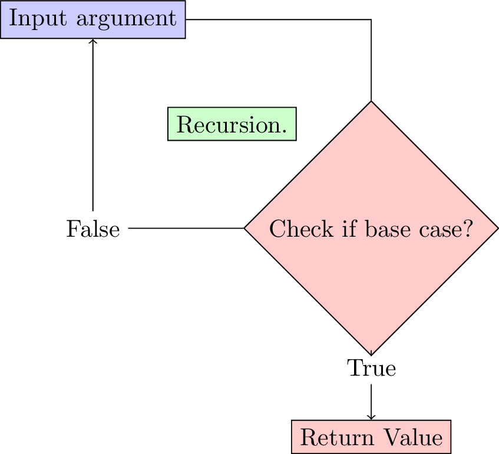

# Week 3 -  Data Structures and Recursion

This lab sheet will introduce various data structures and also an important concept called 'recurrence'. After this session you will know how to:

+ Create and manipulate lists;
+ Create and manipulate dictionaries (hash tables);
+ Write data to a file using the `write` and `read` functions;
+ Use the csv python module to read and write csv files;
+ Program some basic algorithms using recurrence.

A YouTube playlist with all the videos for this lab sheet can be found [here](http://www.youtube.com/playlist?list=PLnC5h3PY-znxclcsx-JIwgFqGTXMdItOH).

## Lists in Python

Lists are a particular object in Python that hold ordered collection of other objects. In other languages they are sometimes called 'arrays'. You can think of these as baskets that allow you to hold objects. You can put anything in lists:

+ Numeric variables;
+ Character variables;
+ Other lists;
+ and various other 'things'.

1. **TICKABLE**: The following code creates a list with the numbers from 1, to 10.

    ~~~{.python}
    alist = [1, 2, 3, 4, 5, 6, 7, 8, 9, 10]
    ~~~

    We can manipulate lists in a similar way to strings. Try the following:

    ~~~{.python}
    blist = [30, 40, 50, 60]
    clist = alist + blist
    print clist
    print len(clist)
    print clist[0]
    print clist[-1]
    print clist[3:12]
    ~~~

    We see that python indexes lists just like strings: starting at 0. We can also use the `index` function as for strings. Try:

    ~~~{.python}
    index = clist.index(40)
    print index
    print clist[index:index + 2]
    ~~~

    [Video hint](http://www.youtube.com/watch?v=7FbYcOOB64c)

2. We have seen how to combine two lists using `+` but there is a very useful method on lists called the `append` method. With this we can easily add elements to lists:

    ~~~{.python}
    mylist = []
    for i in range(11):
        if i % 2 == 0:
            mylist.append(i)
    print mylist
    ~~~

    This makes use of the range function that we see in the previous lab sheet.

    [Video hint](http://www.youtube.com/watch?v=DWiHBdf5mQI)

3. **TICKABLE** Create a list with the first 1300 integers divisible by 3. What is the largest such number?

    [Video hint](http://www.youtube.com/watch?v=7KxOxWC3h78)

4. There is another way of creating/manipulating lists in python called list _comprehensions_. The following code give the squares of the first 10 integers:

    ~~~{.python}
    squares = [e ** 2 for e in range(1, 11)]
    print squares
    ~~~

    We can include logical statements to only give the squares of odd numbers:

    ~~~{.python}
    squares = [e ** 2 for e in range(1, 11) if e % 2 == 1]
    print squares
    ~~~

    [Video hint](http://www.youtube.com/watch?v=8WXIY18RJiY)

5. **TICKABLE** By creating a function and using list comprehensions, create a list of $f(n)$ for all integers $n\leq 100$ where $f(n)$ is given below:

    $$f(n) = \begin{cases}
       n ^ 3,& \text{ if $n$ odd}\\
       n ^ 2 + 1,& \text{ if $n$ is divisible by }4\\
       n - 1,& \text{otherwise}
    \end{cases}$$

    [Video hint](http://www.youtube.com/watch?v=cr_QV3fF-Ls)

6. There are various other things that we can do to a list. Including getting the highest, lowest values as well as the length of the list:

    ~~~{.python}
    alist = [1,74,2,100,-123]
    print max(alist)
    print min(alist)
    print len(alist)
    ~~~

    [Video hint](http://www.youtube.com/watch?v=JslPoHRe3kk)

## Dictionaries in Python

7. **TICKABLE** In computer science 'hash tables' are used as an efficient way to find particular data that is used often. In python 'hash tables' are called dictionaries. To understand this consider the following list of lists:

    ~~~{.python}
    badphonebook = [["Vince", 3],
                    ["Zoe", 2],
                    ["Julien", 6],
                    ["Thomas", 10],
                    ["Mike", 1],
                    ["Matt", 4]]
    ~~~

    (Note that you can write lists over multiple lines)

    To find a particular phone number in this phone book we would need to go through every element of the phone book to check if it was the right one\text{ (as shown in Figure \ref{W03-img01)}}:

    

    ~~~{.python}
    def searchpb(target):
        for e in badphonebook:
            print "Checking %s" % e
            if e[0] == target:
                return e[1]
        return "%s not in phonebook" % target
    ~~~

    Code this function and use it to find all the phone numbers in the above phone book. Try to find some strings that are not in the phone book.

    **In reality this is not how a phone book is designed.** Names are in a given order (alphabetical) and so it is easier to know _where a name is supposed to be_\text{ (as shown in Figure \ref{W03-img02)}}. This is implemented in python using 'dictionaries' which are an **unordered set of _key:value_ pairs**.

    

    This code creates the above phone book as a dictionary with the names as _keys_ and the numbers as their _values_:

    ~~~{.python}
    goodphonebook = {"Vince": 3,
                        "Zoe": 2,
                        "Julien": 6,
                        "Thomas": 10,
                        "Mike": 1,
                        "Matt": 4}
    ~~~

    (Note that you can write dictionaries over multiple lines)

    To query a dictionary we can use the `get` method:

    ~~~{.python}
    goodphonebook.get("Thomas")
    goodphonebook.get("Brayden")
    goodphonebook.get("Brayden", 'Not in book')
    goodphonebook.get("Thomas", 'Not in book')
    ~~~

    We can also modify an element of a dictionary as follows:

    ~~~{.python}
    print goodphonebook['Vince']
    goodphonebook['Vince'] = 8
    print goodphonebook['Vince']
    ~~~

    We must just be careful as if we use square brackets for a value that is not in a dictionary we will obtain an error:

    ~~~{.python}
    print goodphonebook['Brayden']
    goodphonebook['Brayden'] = 12
    print goodphonebook['Brayden']
    ~~~

    **Note: A key must be a string or a numerical variable. The associated value of a key can be anything.**

    [Video hint](http://www.youtube.com/watch?v=CuyHg-1Let0)

8. Iterate over the list `badphonebook` to initiate the `pb` as the equivalent dictionary:

    ~~~{.python}
    pb = {}
    for e in badphonebook:
        ...
    ~~~

    [Video hint](http://www.youtube.com/watch?v=ZZv2sB57BgA)

9. Note that it is also possible to iterate over keys in a dictionary:

    ~~~{.python}
    for e in goodphonebook:
        print goodphonebook[e]
    ~~~

    [Video hint](http://www.youtube.com/watch?v=cZWwJgvRbBE)

## Writing data to files

10. **TICKABLE** All of the data we handle with variables, lists and dictionaries lives in the 'memory' of a computer when our python code is running. When the program stops running the data is lost. There will be occasions when we want to write our data to a file on the hard drive of a computer (so that it is always available even when we turn the computer off).

    To do this we need Python to open a file (usually a basic text file), write strings to the text file and then close the file. The following code opens (or creates a) text file in 'write mode' (that's what the `w` is for) and writes the numbers 1 to 10 to it:

    ~~~{.python}
    textfile = open('mytextfile.txt', 'w')
    for i in range(1, 11):
        textfile.write("%s\n" % i)
    textfile.close()
    ~~~

    Note that the string we are writing at each step of the loop ends with a `\n`. This is a special character that tells the writer to write a new line. There are other special characters such as `\t` which tells the writer to include a tabulated space.

    [Video hint](http://www.youtube.com/watch?v=HSz1A8ZHWWg)

11. To read data from a file, we need to open the file in 'read mode':

    ~~~{.python}
    textfile = open('mytextfile.txt', 'r')
    string = textfile.read()
    print string
    ~~~

    This string is not particularly helpful. To transform the string to a list we can use the `split` method which seperates a string on a given character:

    ~~~{.python}
    data = string.split('\n')
    print data
    ~~~

    All the variables in this list are still character variables. To convert them to numeric variables we can use a list comprehension:

    ~~~{.python}
    data = [int(e) for e in data[:-1]]
    ~~~

    [Video hint](http://www.youtube.com/watch?v=3ljPll8cG3A&feature=youtu.be)

12. **TICKABLE** The following function checks if a number is prime or not. Read through the function and ensure that you understand it.

    ~~~{.python}
    def isprime(n):
        return min([n % e for e in range(2, n)]) != 0
    ~~~

    The file [W03_D01.txt](./Data/W03_D01.txt) contains a list of integers. Read in these integers and print to screen how many of them are prime. (If you would like a bit of a challenge, print to to screen the number of unique primes as the file contains various repetitions of numbers).

    [Video hint](http://www.youtube.com/watch?v=Tbv0s_GEJ1I)

13. There is a common data format called 'csv' short for 'comma separated value'. There is a python library that allows for the easy use of this format when writing a lot of data to files. Watch the following video and experiment with this library.

    [Video hint](http://www.youtube.com/watch?v=jQ9aDyBWCXI)

## Recursion

14. **TICKABLE** Recursion is an important technique in programming. It often allows you to write code in a much more succinct way and is intimately linked to mathematics where sequences can be defined recursively. For example, consider:

    $$X_n=\begin{cases}
    1,& n=1\\
    2X_{n-1},& n>1
    \end{cases}$$

    To calculate $X_3$, we apply the formula and get:

    $$X_3=2X_2$$

    at this point we must calculate $X_2$:

    $$X_2=2X_1$$

    and we now apply the formula to calculate $X_1$:

    $$X_1=1$$

    so by substituting all this in to our previous equation we get

    $$X_3=4$$

    Here is an iterative approach to programming this:

    ~~~{.python}
    def iterX(n):
        r = 1
        for i in range(n - 1):
            r *= 2
        return r
    ~~~

    Experiment and understand this function to verify that it is giving the correct results.

    The following code is a **recursive** approach to programming this:

    ~~~{.python}
    def recX(n):
        if n == 1:
            return 1
        return 2 * recX(n - 1)
    ~~~

    Note that this approach is much more closely related to the actual definition of what we are trying to compute. \text{The basic idea behind recursion is shown in Figure \ref{W03_img01}.} In general we will always either be considering a _base_ case or a case than can be reduced.

    

    [Video hint](http://www.youtube.com/watch?v=EYPT4Ykx5IU)

15. **TICKABLE** Program two functions that return $n!$ in both an iterative approach and a recursive approach.

16. Write a recursive program for the Fibonacci sequence.
