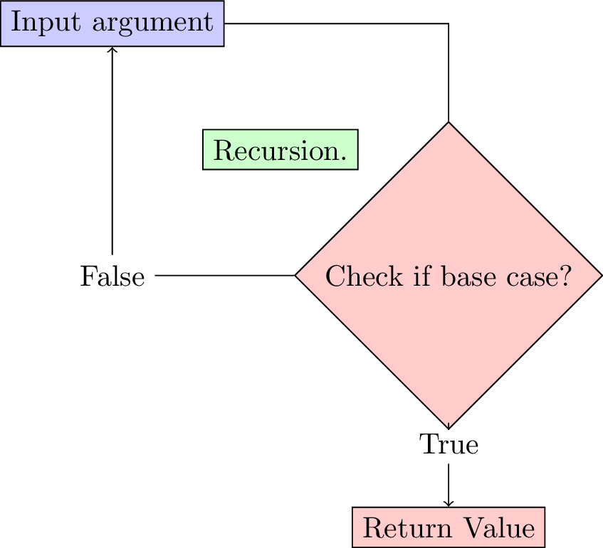

# Week 4 -  Sorting and Searching Algorithms

This lab sheet will introduce two algorithms from computer science. After this session you will be able to sort and search lists using the two following algorithms:

+ Insertion and Bubble sort algorithm;
+ Binary search.

## Sorting Algorithms

1. **TICKABLE** The following code creates a list of digits from 1 to 31.

    ~~~{.python}
    l = range(1, 31)
    print l
    ~~~

    If we import the random library we can pick a random sample of the list and `shuffle` this it (do not worry too much about this):

    ~~~{.python}
    import random
    jumbledlist = random.sample(range(1, 31), 20)
    print jumbledlist
    ~~~

    Using pen and paper, sort the above list, attempting to understand a general approach to doing this. Write a function `jumbledlist` that takes as arguments: `maximumnumber` and `sizeoflist` which returns a jumbled list of integersas above.

2. **TICKABLE** Python has a built in method on lists to sort them: `sort()`:

    ~~~{.python}
    l = jumbledlist(30, 20) # Use the function you created above.
    print l
    l.sort()
    print l
    ~~~

    In this question we will take a look at one type of algorithm that can be used to sort a list: "Selection sort".

    The main idea behind this algorithm is to create a new (empty at first) list and go through the old list and slowly pick out the 'next' element to go in the new list\text{ as shown in Figure \ref{W04-img01}}.

    

    Here is some **pseudo code** that describes this:

        INITIATE NEWLIST
        WHILE MORE ELEMENTS IN NEWLIST THAN IN OLDLIST:
            FIND SMALLEST ELEMENT IN OLDLIST
            MOVE THAT ELEMENT TO NEWLIST

    It should be straightforward to see that at every step of this algorithm we the total size of NEWLIST and OLDLIST stay the same. As such we can simply put the NEWLIST at the beginning of the OLDLIST so that at each step of our algorithm we are basically moving elements from the unsorted part of the list to the sorted part of the list\text{ as shown in Figure \ref{W04-img02}}.

    

    Here is some **pseudo code** that describes the 'insertion sort' algorithm:

        SET FIRSTUNSORTED TO 0
        WHILE NOT SORTED:
            FIND SMALLEST UNSORTED ITEM
            SWAP FIRST UNSORTED ITEM WITH EARLIEST UNSORTED ITEM
            SET FIRSTUNSORTED TO FIRSTUNSORTED + 1

    Here is some python code that carries out the above algorithm, experiment with it and include comments:

    ~~~{.python}
    def insertionsort(data):
        firstUnsorted = 0
        while firstUnsorted < len(data) - 1:
            indexOfSmallest = firstUnsorted
            index = firstUnsorted + 1
            while index <= len(data) - 1:
                if data[index] < data[indexOfSmallest]:
                    indexOfSmallest = index
                index += 1
            data[firstUnsorted], data[indexOfSmallest] = data[indexOfSmallest], data[firstUnsorted]
            firstUnsorted += 1
    ~~~

3. There are various other algorithms that can be used to sort lists. The following pseudo code is for an algorithm called 'bubble sort'. Attempt to write out the corresponding python code:

        SET FIRSTUNSORTED TO 0
        SET SWAP TO TRUE
        WHILE FIRSTUNSORTED < LENGTH - 1 AND SWAP:
            SET SWAP TO FALSE
            "BUBBLE UP" THE SMALLEST ITEM IN AN UNSORTED LIST
            SET FIRSTUNSORTED TO FIRSTUNSORTED + 1

    Here's the pseudo code for the "BUBBLE UP" part of the above code:

        SET INDEX TO LENGTH - 1
        WHILE INDEX >  FIRSTUNSORTED + 1:
            IF DATA[INDEX] < DATA[INDEX - 1]
                SWAP DATA[INDEX] AND DATA[INDEX - 1]
                SET SWAP TO TRUE
            SET INDEX TO INDEX - 1

4. The 'time' module allows you to get the current system time on your machine:

    ~~~{.python}
    import time
    print time.time()
    ~~~

    Using this we can write a function that will evaluate how long it takes to run a particular function:

    ~~~{.python}
    timing(string):
        starttime = time.time()
        eval(string)
        return time.time() - starttime
    ~~~

    This uses the `eval` function which runs any string of code. We can define the following test function:

    ~~~{.python}
    def testfunction():
        return 10 ** 1000
    ~~~

    We see how long a single run of this testfunction takes using our timing function:

    ~~~{.python}
    print timing("testfunction")
    ~~~

    Modify the timing function so that it returns the average time taken over 10 evaluations of the passed code. Furthermore use this function to evaluate the performance of the bubble sort and insertion sort algorithms.

    (Note that python also has a timeit library which offers timing functionality.)

## Searching algorithms

5. **TICKABLE** Consider the data in [W04_D01.txt](./Data/W04_D01.txt). Search this file for the index of 2536. Do this by hand and then check your answer using the `index` method. How could you do this if it was to be done in pairs (2 students searching the list)?

6. One searching algorithm we will look at is called "sequential search". This algorithm starts by sorting a list, and then going through it until it either reaches the element in question or gets to a point in the list that the item in question **should** be at.

        SORT THE LIST
        SET INDEX TO 0
        SET FOUND TO FALSE
        WHILE INDEX < LENGTH and NOT FOUND:
            IF DATA[INDEX] = ITEM:
                FOUND = TRUE
            ELSE IF DATA[INDEX] > ITEM:
                INDEX = LENGTH
            ELSE:
                INDEX = INDEX + 1
        IF FOUND:
            RETURN INDEX
        ELSE:
            RETURN "ITEM NOT IN LIST"

    Write some python code for this and use it to find the index of following numbers:

    ~~~{.python}
    targets = [12,
               593,
               9402,
               4320]
    ~~~

    in the file [W04_D01.txt](./Data/W04_D01.txt).

7. **TICKABLE** Another searching algorithm is called 'binary search'. In this algorithm, a **sorted** list is split in two recursively and by considering the first and last element of each list we immediately know which sublist to search\text{ as shown in Figure \ref{W04-img03}}.

    

    Here is some pseudo code that describes this:

        SORT THE LIST
        SET INDEX TO 0
        SET LAST TO LENGTH - 1
        SET FOUND TO FALSE
        WHILE FIRST <= LAST AND NOT FOUND:
            SET MIDDLE TO (FIRST + LAST) / 2
            IF DATA[MIDDLE] = ITEM:
                SET FOUND TO TRUE
            ELSE:
                IF DATA[MIDDLE] > ITEM:
                    SET LAST TO MIDDLE - 1
                ELSE:
                    SET FIRST TO MIDDLE + 1
        RETURN MIDDLE

    Here is some python code that carries out the above algorithm, experiment with it and include comments:

    ~~~{.python}
    def binarysearch(data, item):
        first = 0
        last = len(data) - 1
        found = False
        while first <= last and not found:
            middle = int((first + last) / 2)
            if item == data[middle]:
                found = True
            elif item < data[middle]:
                last = middle - 1
            else:
                first = middle + 1
        return middle
    ~~~

8. Use the timing function of question 4 to compare the performance of the binary search and sequential search algorithms.

9. The binary search algorithm is a very nice algorithm to write in a recursive way, attempt to do this.
