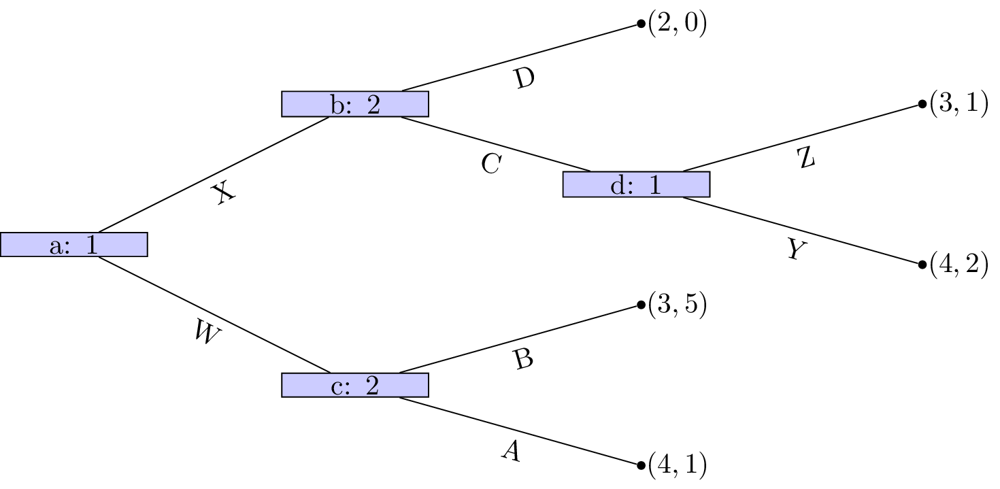

# Week 1 - Conditional Statements, flow control and functions

This lab sheet will serve as a basic introduction to programming. After this session you will know the basic python syntax to carry out the following:

- Set up basic variables;
- Write if statements (so called: 'Conditional statements');
- Write while and for loops (so call: 'flow control');
- Define functions;
- Write clear and consistent code.

## Programming in Python

Python is a programming language. There are various other programming languages:

- Java
- C
- C++
- Ruby
- VBA

and many more.

A programming language allows you to write a **program** which is a **sequence of instructions that specifies how to perform a computation**.

When writing a program one makes use of an Integrated Development Environment: **IDE**. There are various (freely available) IDE's:

- Eclipse
- IDLE
- Vim

and many more. We will be using the simplest IDE available: IDLE which comes bundled with python (in your own time be sure to investigate others as it is a question of personal choice).

- **T1**: Open up IDLE and in the **interpreter** type the following code\text{ (as shown in Figure \ref{W02-S01})} and press `ENTER`:

        print "Hello world"

    

- **T2**: For short bits of code typing directly in to the interpreter is fine (and in fact sometimes very helpful). However, for longer pieces of code one needs to write a file containing all the commands. Open a script and type the same code as above\text{ (as shown in Figure \ref{W02-S02})}:

        print "Hello world"

Send this code to the interpreter (you will be asked to save the file: choose a name and system that will be helpful to you and that you stick with for the rest of the course: `W02.py`).

**INCLUDE VIDEO HERE**

## Basic variables

A value is one of the basic building blocks used by a program. Values may be of various types.

- **T3**: Experiment with the following code which creates variables (by assigning them a value) and checks what type they are using the `type` function. 

        num1 = 23
        print type(num1)

        num2 = 23.5
        print type(num2)

        str1 = "Hello world!"
        print type(str1)

- **4**: We can carry out basic arithmetic operations using python. Take a look at the following:

        num = 2
        num = num +3
        print num

this can however also be written:

        num = 2
        num += 3
        print num

Simlarly, `-`, `*`, `/` and `**` can be used for:

- subtraction;
- multiplication;
- division;
- exponentiation.

- **T5**: Assign the variable `num` to a value of 5.2, what is the result of adding 7 to `num` then muliplying `num` by 300 then dividing `num` by 4 and finally raising `num` to the power of 3?

- **T6**: We can carry also manipulate strings. Try out the following:

        str1 = "This is a string that I will learn to manipulate"
        str2 = ", string manipulation is very useful."
        str = str1 + str2
        print str
        print len(str)
        print str[0]
        print str[-1]
        print str[3:7]

We see that python index a string, starting at 0, we can also use negative values to start from the end.

        index = str.index("string")
        print index
        print str1[index:index + len("string")]

There are various other things that can be done "on" strings, be sure to research these.

- **7**: It is possible to go from one type of variable to another.

        f = 10.2
        print int(f)
        print float(int(f))
        
        s = str(f)
        print s
        print type(s)

It is also possible to write strings using other variables.

        numberofcats = 2
        name = "Vince"
        height = 1.7
        notborn = "the UK"

One way to do this would be:

        str = "My name is " + name +", I am " + str(height) + " metres tall, have " + str(numberofcats) + " cats and was not born in " + notborn

Python (and most other languages) has a nicer way of doing this:

        str = "My name is %s, I am %.2f metres tall, have %i cats and was not born in %s" % (name, height, numberofcats, notborn)

The `%` is used to denote that a value must be input in to the string. The symbols after the `%` say what type of value is to be included:

- `s`: A String
- `.`_x_`f`: A float rounded to _x_ decimal places
- `i`: An integer

There are other types that can be used as well.

## If statements

- **8** An `if` statement allows you to tell a program to carry out something based on the value of a `Boolean` variable.

        bool = True
        if bool:
            print "bool is %s" % bool

Try typying the above code but change `bool` to `False`. **Note: in python, indentation is important! In all languages it is good practive, in python it is a requirement**.

It is easy to create boolean variables using the following:

- `<`: strictly less than
- `>`: strictly greater than
- `<=`: less than or equal
- `>=`: greater than or equal
- `==`: equals **Note: this is a test of equality as opposed to the basic `=` which is an assignment.**

- It is also possible to give alternatives to an `if statement`:

        num = 11
        print num % 2 == 0
        if num % 2 == 0:
            print "num is an even number"
        else:
            print "num is an odd number"

(The `%` operator gives the remainder of one number when divided by another.)

**Spend some time understanding the `elif` statement.**

- **T9**: Find some information on the `raw_input` statement and write some code that prompts a user to input a string. If the length of that string is more than 10 then print "that string has length more than 10" otherwise "that string has length less than 9".

## Loops

An important type of programming instruction allows us to make a program repeat certain things. These are also referred to as loops. There are two basic types of loops "count controlled loops" and "event controlled loops".

- **10**: The `range()` function in python allows us to create a list of integers easily. **A list is a new type of variable that we will look at more closely next week**:

        print range(10)

Note that this gives a list starting at 0 of size 10 (so it goes up to the integer 9). We can include 2 arguments in to this function:

        print range(3,10)

We can also include 3 arguments:

        print range(0,10,2)

Using `range()` we can use the basic `for` loop in python (a type of count controlled loop):

        for i in range(10):
            print i

The first line of the above defines the iterator `i` and tells it the values it will go through\text{ as shown in Figure \ref{W02-img01}}.

We can in fact iterate over anything in a list:

        for e in ["dog", "cat", 3, "I love mathematics"]:
            print e

- **T11**: Write some code that calculates the total of the first 1000 integers. Modify the code so that it calculates the sum of the first integers lss than 1000 that are not divisable by 3.

- **12**: Event based loops are implimented in python using a `while` command that keep repeating a set of commands until a boolean variable is `False`.

        k = 0
        while k < 10:
            print k
            k += 1

The second line of the above checks the boolean variable `k < 10` and as long as this is `True` loops through the rest of the commands\text{ as shown in Figure \ref{W02-img01}}:

- **T13**: Write some code to find $N$ such that $\sum_{i=0}^Ni^2$ is more than 20000.

- **14**: It can be shown (you are not required to check this) that the following sequence:

$$x_{n+1} = \frac{x_n+K/x_n}{2}$$

approaches $\sqrt{K}$ as $n$ increases. Write some code to verify this to any given level of precision.

- **15**: Take a look at the `random` python library (we will talk about libraries in detail later) and write some code that uses the `input` function to code a simple game:

    - The program chooses a random integer;
    - The user tries to guess the integer;
    - At every guess the program indicates if the guess is too high or too low.

## Functions

To be able to make progress from the basic on this sheet we need a way to write "recycle" code: functions. Much like mathematical functions, functions in programming can take multiple arguments and carry out tasks with those arguments\text{ as shown diagramaticaly in Figure \ref{W02-img03}}.

- **16**: The following code defines a very simple function (with no arguments):

        def PrintHello():
            print "Hello"

The name of the function is `PrintHello` and `def` is the python syntax used to define it. When we run the above two lines of code, nothing is output. To call the function we simply write:

        PrintHello()

We can modify our function to take an argument:

        def PrintHello(name):
            print "Hello, " + name

- **17**: The following function makes use of the `return` call to actually return a result of the function:

        def MyDiv(a, b):
            return a/b

- **T18**: Include a check in the `MyDiv` function to ensure that no division by 0 is attempted.

- **T19**: Create a function that returns the sum of the first $K$ integers not divisiable by $B$. Investigate "using optional arguments" and set $K$ and $B$ to have default values 10000 and 3 respectively. 

- **20**: Create a function that return the square root of a number using the algorithm suggested in question 14. Write some code that compares the output of this algorithm to the actual square root for the first 10000 digits.

- **T21**: Write a function `Fibonacci` that uses loops to calculate the $n$th number of the Fibonacci sequence:

$$X_n=\begin{cases}1,& n=0,1\\
X_{n-1}+X_{n-2}\end{cases}$$

## Writing clear code

When writing code it is **very important** to include comments throughout. How well commented code is will be evaluated throughout this module. Comments should be thought of as messages explaining what instructions are being given by the code. This is useful to the writer of the code but more importantly to anyone who might want to add/modify the code.

There are two ways of writing comments in python:

1. Use the `#` to indicate to the interpreter that everything that is about to follow on a given line is to be ignored.
2. Use `"""` to indicate the beginning and end of multi line comments (note that this can also be used to write multi line strings).

- **22**: The following is an example of a single line comment in the middle of some code:

        num = 2
        num += 3  # Add 3 to num 
        print num

- **23**: The following is an example of a multilined comment in the definition of a function:

        def MyFunc(a,b):
        """
        This function calculates the ratio of two numbers raised to the sum of the two numbers.

        Arguments:
            a: the first number
            b: the second number

        Output: (a / b) ** (a + b)
        """
            return (a / float(b)) ** (a + b)

- **T24**: One final aspect that is very important when writing code is **convention**. When working on a project with multiple people for example being able to use the same convention can be very beneficial. The most commonly known convention for python is [PEP8](http://www.python.org/dev/peps/pep-0008/). You are advised to use the following general summary of PEP8 for this course:

- Variable names

Use a descriptive `lowercase` (all lowercase characters) for variable names.

Yes:

        myvariable
        sqrtvar
        var

No:

        my_variable
        SqrtVAR

On some occasions it might be appropriate to make some exceptions (for example using a single letter for a very simple variable).

- Function names

Use a descriptive `CamelCase` (all words together with new words starting with a capital).

Yes:
        
        MyFunc()
        CalculateSqrtOfNumber()

No:

        My_Func()
        Myfunc()
        MYFUNC()

Again on some occasions it might be appropriate to make exceptions.

- White spaces

Include a whitespace between operators (`+`, `-`, etc) and a whitespace after a comma `,`.

Yes:
    
        print 2 + 2
        MyFunc(3, 4)

No:

        print 2+2
        MyFunc(3,4)

Include 2 whitspaces before an inline comment `#` at the end of a line of code.

Yes:

        # Just leave a space after the comment symbol if on a single line
        print 2 + 2  # but if you comment at the end of a line leave 2 whitespaces.

No:
    
        print 2 + 2 # So this is not enough space.

Also include two blank lines before the definition of a function.

Yes:

        print 2 + 2

        def MyFunc():
            print 2 + 2

No:

        print 2 + 2

        def MyFunc():
            print 2 + 2

- Comments

Comment well and comment often. In particular use the following convention for functions:

        AFunc():
        """
        Always start a function with a multiline comment to describe what it does.

        Arguments: List the arguments and what format they should be in.
        
        Output: List the expected output of the function.
        """

As and when we see new topics on this course we will also discuss there conventions. 

Go back through your script and ensure that you have used the above convention.
